# Multi-Agent RAG for Vietnamese Legal QA

[](https://www.python.org/downloads/)
[](https://langchain-ai.github.io/langgraph/)
[](https://qdrant.tech/)
[](https://opensource.org/licenses/MIT)

Hệ thống Chatbot pháp lý thông minh sử dụng kiến trúc Multi-Agent trên nền tảng LangGraph, kết hợp Corrective RAG (CRAG) và Self-RAG để đảm bảo câu trả lời chính xác, có trích dẫn và giảm thiểu tối đa hiện tượng ảo giác (hallucination).

---

## Tính năng nổi bật

- **Kiến trúc Multi-Agent**: Sử dụng 6 Agent chuyên biệt phối hợp qua đồ thị có chu trình (Cyclic Graph) để xử lý các tác vụ phức tạp.
- **Tìm kiếm Hybrid**: Kết hợp Vector Search (Semantic) và BM25 (Keyword) trên nền tảng Qdrant để tối ưu hóa khả năng truy xuất.
- **Corrective RAG (CRAG)**: Cơ chế tự động đánh giá chất lượng tài liệu truy xuất và thực hiện tìm kiếm bổ sung trên môi trường Internet khi cần thiết.
- **Self-Reflection**: Kiểm tra và đánh giá hiện tượng ảo giác thông qua Hallucination Grader trước khi phản hồi người dùng.
- **Xử lý dữ liệu thông minh**: Quy trình Smart Chunking được tối ưu hóa theo cấu trúc Điều/Khoản đặc thù của văn bản pháp luật Việt Nam.
- **Hỗ trợ Streaming**: Hiển thị quá trình suy luận và phản hồi của các Agent theo thời gian thực (Real-time).

---

## Kiến trúc hệ thống

Hệ thống được thiết kế dưới dạng một State Machine phức tạp, điều phối bởi LangGraph:

```mermaid
graph LR
    A["👤 USER INPUT<br/>Thời gian làm việc tối đa?"]
    
    B["🎯 Router Agent<br/>Intent Classification"]
    C{Intent<br/>Check?}
    E["❌ Early Exit<br/>No RAG"]
    D["📚 Retriever<br/>Hybrid Search<br/>BM25 + Vector"]
    
    F["📋 Grader<br/>CRAG<br/>Relevance Check"]
    G{Relevant<br/>Docs?}
    H["🌐 Web Search<br/>Tavily API"]
    
    I["✍️ Generator<br/>Answer Synthesis<br/>+ Citations"]
    
    J["🔍 Hallucination Grader<br/>Self-Reflection"]
    K{Answer<br/>Quality OK?}
    L["🔄 Regenerate<br/>Max 3x"]
    
    M["✅ FINAL OUTPUT<br/>Answer + Citations<br/>Confidence"]
    N["📤 Response to User"]
    
    A --> B
    B --> C
    C -->|legal_query| D
    C -->|out_of_scope| E
    E --> N
    
    D --> F
    F --> G
    G -->|No| H
    G -->|Yes| I
    H --> I
    
    I --> J
    J --> K
    K -->|Fail| L
    L --> J
    K -->|Pass| M
    
    M --> N
    
    style A fill:#e3f2fd,stroke:#1976d2,stroke-width:3px
    style B fill:#fff3e0,stroke:#f57c00,stroke-width:2px
    style C fill:#fff8e1,stroke:#f9a825,stroke-width:2px
    style D fill:#f3e5f5,stroke:#7b1fa2,stroke-width:2px
    style E fill:#ffebee,stroke:#c62828,stroke-width:2px
    style F fill:#f3e5f5,stroke:#7b1fa2,stroke-width:2px
    style G fill:#fff8e1,stroke:#f9a825,stroke-width:2px
    style H fill:#e8f5e9,stroke:#388e3c,stroke-width:2px
    style I fill:#fce4ec,stroke:#c2185b,stroke-width:2px
    style J fill:#e0f2f1,stroke:#00897b,stroke-width:2px
    style K fill:#fff8e1,stroke:#f9a825,stroke-width:2px
    style L fill:#ede7f6,stroke:#512da8,stroke-width:2px
    style M fill:#c8e6c9,stroke:#2e7d32,stroke-width:3px
    style N fill:#e1f5fe,stroke:#01579b,stroke-width:2px
```



### Các thành phần chính (Agents)

1. **Router**: Phân loại ý định người dùng (pháp lý, thủ tục, hội thoại thông thường).
2. **Retriever**: Truy xuất dữ liệu đa phương thức từ Qdrant.
3. **Grader**: Đánh giá mức độ phù hợp và tính đầy đủ của tài liệu đã truy xuất.
4. **Web Searcher**: Công cụ fallback tìm kiếm thông tin bên ngoài khi dữ liệu nội bộ không đáp ứng.
5. **Generator**: Tổng hợp câu trả lời cuối cùng kèm trích dẫn nguồn pháp luật cụ thể.
6. **Hallucination Grader**: Đối soát câu trả lời với tài liệu gốc để đảm bảo tính xác thực.

---

## Công nghệ sử dụng

- **Framework**: LangGraph, FastAPI
- **LLMs**: Gemini 2.0/2.5
- **Vector Database**: Qdrant
- **Embedding Models**: paraphrase-multilingual-MiniLM-L12-v2
- **Frontend**: React, Vite, Tailwind CSS

---

## Cấu trúc thư mục
```text
.
├── api/                        # Khởi tạo FastAPI server và định nghĩa các routers
│   ├── main.py                 # Điểm khởi chạy ứng dụng API chính
│   └── routers/                # Chứa các định nghĩa endpoint chi tiết
│       └── qa.py               # Xử lý các yêu cầu hỏi đáp pháp luật
├── data/                       # Quản lý dữ liệu đầu vào
│   └── raw/                    # Lưu trữ văn bản luật gốc (định dạng .txt, .pdf)
├── frontend/                   # Ứng dụng giao diện người dùng (React + Vite)
│   ├── src/                    # Mã nguồn giao diện chính
│   │   ├── App.jsx             # Thành phần giao diện cốt lõi
│   │   ├── index.css           # Định nghĩa phong cách toàn cục
│   │   └── main.jsx            # Điểm vào của ứng dụng React
│   └── package.json            # Quản lý các phụ thuộc phía frontend
├── scripts/                    # Các kịch bản tiện ích phục vụ vận hành và kiểm thử
│   ├── build_index.py          # Kịch bản xử lý và đánh chỉ mục tài liệu vào Qdrant
│   ├── test_graph.py           # Kiểm thử tích hợp luồng xử lý Multi-Agent
│   ├── run_app.py              # Kịch bản khởi chạy nhanh ứng dụng
│   └── test_agents.py          # Kiểm thử độc lập từng Agent
├── src/                        # Logic xử lý cốt lõi của hệ thống backend
│   ├── agents/                 # Logic chi tiết của các thành phần thông minh
│   │   ├── router.py           # Agent phân loại ý định
│   │   ├── retriever.py        # Agent truy xuất tài liệu
│   │   ├── grader.py           # Agent đánh giá độ liên quan
│   │   ├── generator.py        # Agent tổng hợp phản hồi
│   │   ├── web_searcher.py     # Agent tìm kiếm thông tin trực tuyến
│   │   └── hallucination_grader.py # Agent kiểm định tính xác thực
│   ├── data_pipeline/          # Quy trình xử lý dữ liệu (ETL)
│   │   ├── chunker.py          # Chia nhỏ tài liệu theo ngữ nghĩa pháp lý
│   │   ├── extractor.py        # Trích xuất văn bản từ các định dạng file
│   │   └── indexer.py          # Logic đẩy dữ liệu vào Vector Database
│   ├── graph/                  # Định nghĩa luồng công việc (Workflow)
│   │   ├── graph.py            # Cấu trúc đồ thị LangGraph
│   │   ├── state.py            # Định nghĩa trạng thái chung của hệ thống
│   │   └── edges.py            # Logic chuyển tiếp giữa các nút trong đồ thị
│   ├── models/                 # Định nghĩa các cấu trúc dữ liệu (Pydantic models)
│   ├── utils/                  # Các công cụ bổ trợ (LLM factory, Logger, Embedding)
│   └── config.py               # Quản lý cấu hình hệ thống và biến môi trường
├── docker-compose.yml          # Cấu hình container hóa (Qdrant service)
├── requirements.txt            # Danh sách các thư viện Python cần thiết
└── .env                        # Lưu trữ các khóa API và thông số bảo mật
```

---

## Hướng dẫn cài đặt

### 1. Yêu cầu hệ thống
- Python >= 3.10
- Docker & Docker Compose

### 2. Cài đặt môi trường
```bash
# Clone repository
git clone https://github.com/your-username/Multi-Agent-RAG-for-Vietnamese-Legal-QA.git
cd Multi-Agent-RAG-for-Vietnamese-Legal-QA

# Create virtual environment
python -m venv .venv
source .venv/bin/activate  # Linux/Mac
# .venv\Scripts\activate  # Windows

# Install dependencies
pip install -r requirements.txt
```

### 3. Cấu hình hệ thống
Sao chép file `.env.example` thành `.env` và cập nhật các thông số:
- `GOOGLE_API_KEY`: API Key cho Gemini 
- `TAVILY_API_KEY`: API Key phục vụ tìm kiếm Web
- `QDRANT_URL`: URL của Qdrant server

### 4. Khởi động dịch vụ
```bash
# Khởi chạy Qdrant bằng Docker
docker-compose up -d qdrant
```

---

## Quy trình vận hành

### Khởi tạo cơ sở dữ liệu tri thức
1. Đưa các văn bản pháp luật vào thư mục `data/raw/`.
2. Chạy kịch bản lập chỉ mục:
   ```bash
   python scripts/build_index.py
   ```

### Khởi chạy ứng dụng
1. Chạy Backend API:
   ```bash
   python api/main.py
   ```
2. Khởi chạy Frontend (trong thư mục `frontend`):
   ```bash
   npm install
   npm run dev
   ```

---

